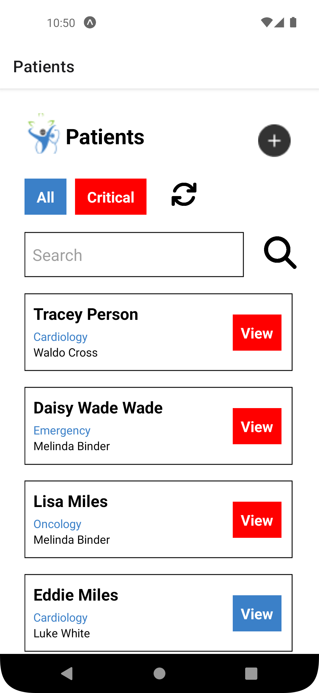
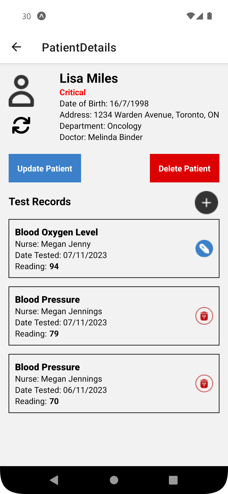

 # React-Native-Healthcare-App
Healthcare application in React Native, also using third-party REST API

### HOW TO RUN:
```console
npm install
npx expo start
```

### FEATURES:
1. The app uses https://github.com/EmreDenizz/Restify-Healthcare-API-Server API server
2. List all patients
3. Search patients by name
4. Filter critical patients 
5. Add a new patient
6. View patient details
7. Update patient information
8. Delete a patient
9. List all medical tests belong to a patient
10. Add new medical test record to a patient
11. Update medical test record
12. Delete a medical test

### SCREENSHOTS:
<kbd></kbd>    <kbd></kbd>    <kbd></kbd>


<kbd></kbd>    <kbd></kbd>    <kbd></kbd> 
